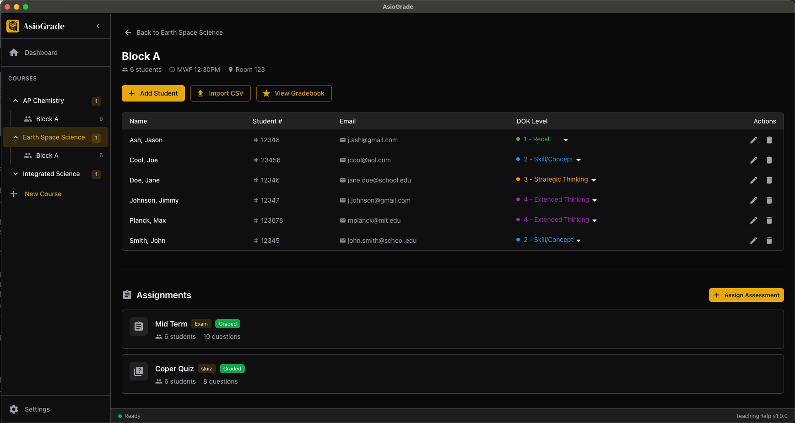

# AsioGrade

A desktop application that helps teachers create AI-powered assessments, generate randomized test versions, and automate scantron grading.



## Features

### Assessment Creation
- **AI-Generated Questions** - Create multiple-choice questions from state teaching standards and course materials
- **DOK-Based Variants** - Generate different difficulty levels (Webb's Depth of Knowledge 1-4) for differentiated instruction
- **Version Randomization** - Automatically create A/B/C/D versions with shuffled questions and answer choices

### Grading
- **Scantron Generation** - Print bubble sheets with QR codes for automatic identification
- **PDF Scanning** - Upload scanned answer sheets for automated grading
- **Visual Review** - See cropped bubble images for flagged answers requiring manual review
- **Gradebook** - View grades in a table format and export to CSV

### Class Management
- **Course & Section Organization** - Organize classes by course and section (periods/blocks)
- **Student Rosters** - Import students via CSV or add manually
- **DOK Levels** - Assign Depth of Knowledge levels to students for differentiated assessments
- **Google Drive Sync** - All data stored in your Google Drive for easy access and backup

## Tech Stack

- **Framework:** Electron (cross-platform: macOS, Windows, Linux)
- **Frontend:** React 19, TypeScript, Material UI v7, Zustand
- **Backend Services:** Google Drive API, Google OAuth 2.0
- **AI Providers:** OpenAI, Anthropic Claude, Google Gemini
- **PDF Processing:** PDFKit, pdf-lib, opencv-wasm
- **Build:** Vite, electron-builder

## Development

### Prerequisites
- Node.js 18+
- npm 9+

### Setup

```bash
# Install dependencies
npm install

# Run in development mode
npm run dev

# Type check
npm run typecheck

# Build for production
npm run build
```

### Packaging

```bash
# Package for current platform
npm run package

# Package for specific platform
npm run package:mac
npm run package:win
npm run package:linux
```

## Configuration

The app requires Google OAuth credentials for Drive integration. Create a `config/oauth.json` file with your credentials:

```json
{
  "client_id": "your-client-id.apps.googleusercontent.com",
  "client_secret": "your-client-secret"
}
```

AI features require API keys which can be configured in the app's Settings page.

## License

ISC License

## Author

Jason Ash (jason@jasonash.com)
